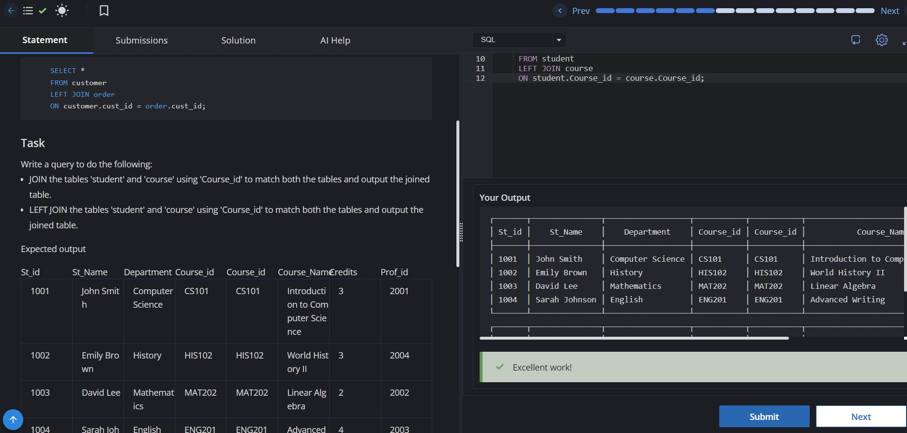
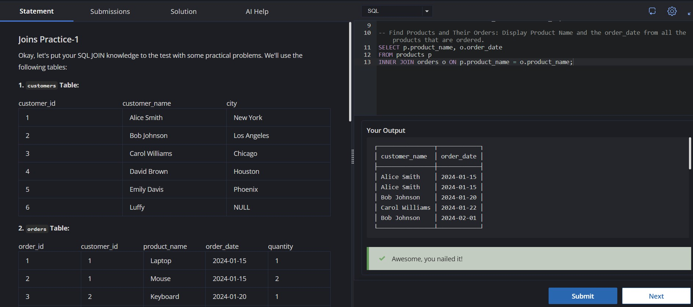
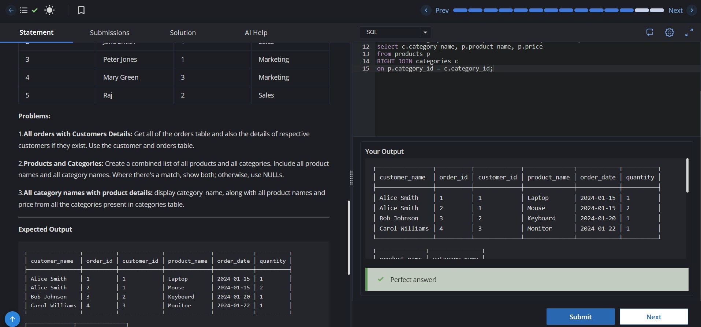
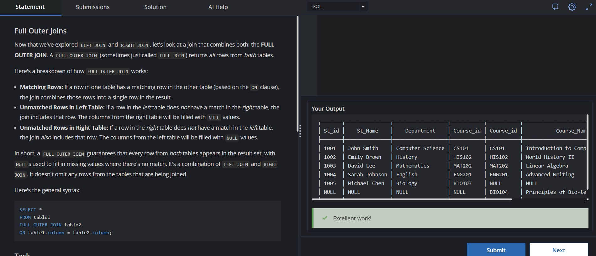
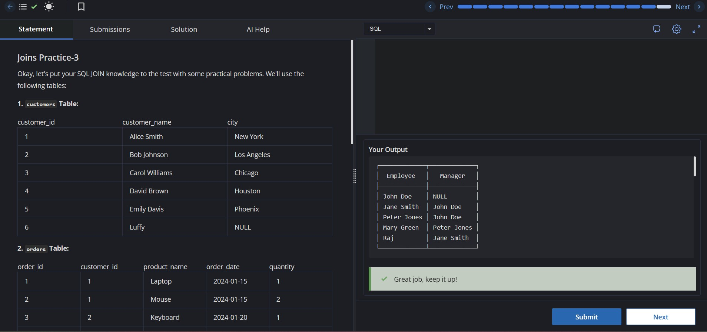
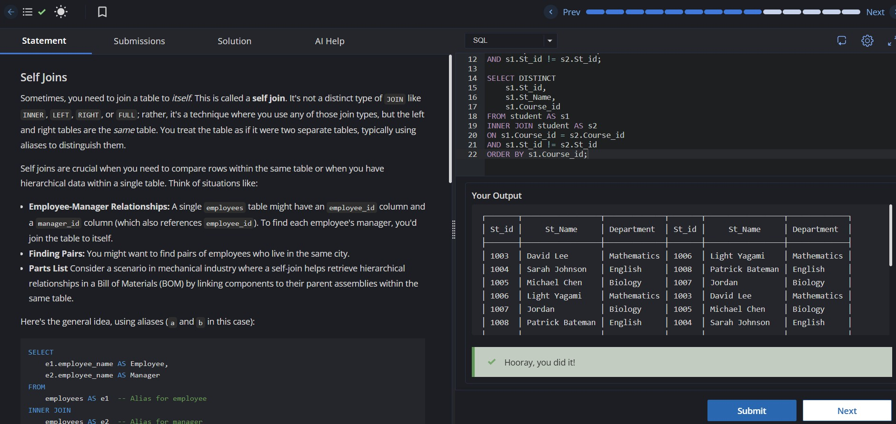

# Experiment 4 – SQL Joins

## 📖 Aim

To study and implement different SQL JOIN operations for combining data from multiple related tables.

---

## 🎯 Objectives

- To understand the concept of SQL JOIN operations.
- To implement INNER JOIN, LEFT JOIN, RIGHT JOIN, FULL OUTER JOIN, CROSS JOIN, and SELF JOIN.
- To retrieve related data from multiple tables using common attributes.
- To understand the relationship between Primary Keys and Foreign Keys.
- To learn how SQL handles unmatched records using `NULL` values.
- To improve SQL query writing and database retrieval skills.

---

## 📁 Files

| File | Description |
|------|-------------|
| **4.1.jpg** | INNER JOIN and LEFT JOIN between Student and Course tables. |
| **4.2.jpg** | JOIN practice involving Customers, Orders, and Products tables. |
| **4.3.jpg** | RIGHT JOIN practice using Customers, Orders, Products, and Categories tables. |
| **4.4.jpg** | SELF JOIN (Employee & Manager) and CROSS JOIN (Customers × Products). |
| **4.5.jpg** | FULL OUTER JOIN between Student and Course tables. |
| **4.6.jpg** | SELF JOIN on the Student table to find students in the same department and students sharing the same favorite course. |

---

## 📚 Programs

### 4.1 – LEFT JOIN & Basic JOIN
**Objective**
- Perform an INNER JOIN between the `student` and `course` tables.
- Perform a LEFT JOIN between the `student` and `course` tables using `Course_id`.

**Concepts Used**
- INNER JOIN
- LEFT JOIN
- NULL Handling

---

### 4.2 – INNER JOIN Practice
**Objective**
Practice SQL JOIN operations using the `customers`, `orders`, and `products` tables.

**Queries Implemented**
- Display customer names with their order dates.
- Display all customers and their ordered products.
- Display products along with their order dates.

**Concepts Used**
- INNER JOIN
- LEFT JOIN
- Table Relationships

---

### 4.3 – RIGHT JOIN Practice
**Objective**
Practice RIGHT JOIN operations using multiple relational tables.

**Queries Implemented**
- Display all orders with customer details.
- Display products with their categories.
- Display all category names with product names and prices.

**Concepts Used**
- RIGHT JOIN
- INNER JOIN
- Multiple Table Joins

---

### 4.4 – CROSS JOIN & SELF JOIN
**Objective**
Implement CROSS JOIN and SELF JOIN operations.

**Queries Implemented**
- Display employees along with their managers using SELF JOIN.
- Display every possible combination of customers and products using CROSS JOIN.

**Concepts Used**
- SELF JOIN
- CROSS JOIN
- Table Aliases

---

### 4.5 – FULL OUTER JOIN
**Objective**
Perform a FULL OUTER JOIN between the `student` and `course` tables.

**Concepts Used**
- FULL OUTER JOIN
- NULL Handling
- Matching and Unmatched Records

---

### 4.6 – SELF JOIN
**Objective**
Implement SELF JOIN operations on the `student` table.

**Queries Implemented**
- Find pairs of students belonging to the same department.
- Display students who have selected the same favorite `Course_id`, ordered by `Course_id`.

**Concepts Used**
- SELF JOIN
- Table Aliases
- INNER JOIN
- ORDER BY

---

## 📚 SQL Concepts Covered

- INNER JOIN
- LEFT JOIN
- RIGHT JOIN
- FULL OUTER JOIN
- CROSS JOIN
- SELF JOIN
- Table Aliases
- Primary Key & Foreign Key
- NULL Handling
- Multi-table Queries

---

## 🎓 Learning Outcomes

After completing this experiment, I am able to:

- Understand the working of different SQL JOIN operations.
- Differentiate between INNER, LEFT, RIGHT, FULL OUTER, CROSS, and SELF JOIN.
- Retrieve and combine related information from multiple database tables.
- Handle missing or unmatched records using `NULL` values.
- Apply SQL JOINs in real-world relational database applications.
- Write efficient SQL queries involving multiple tables.
- Strengthen database design and query optimization skills.

---

## 🛠️ Technologies Used

- SQL
- MySQL
- CodeChef SQL Intermediate

---

## 📸 Screenshots

### 4.1 – INNER JOIN & LEFT JOIN

### 4.2 – INNER JOIN Practice

### 4.3 – RIGHT JOIN Practice

### 4.4 – CROSS JOIN & SELF JOIN

### 4.5 – FULL OUTER JOIN

### 4.6 – SELF JOIN

---

## 👨‍💻 Author

**Ayush Bansal**  
B.E. Computer Science & Engineering  
Chandigarh University

⭐ If you found this repository useful, don't forget to **Star** it!
