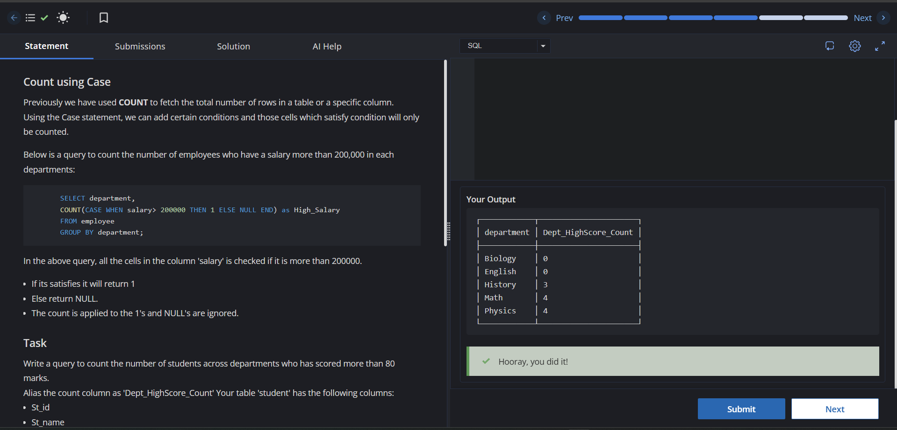
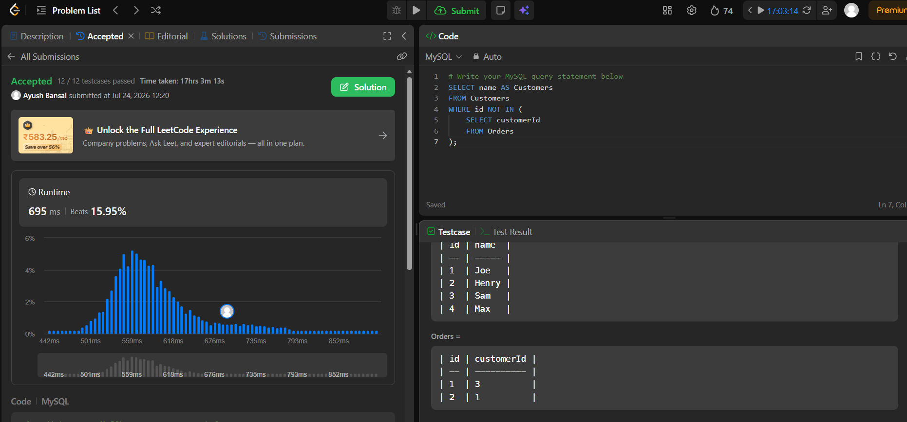
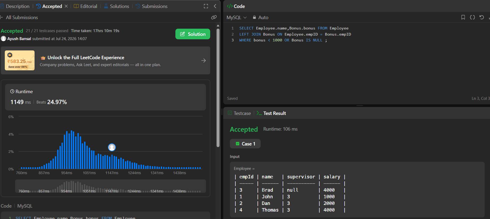

# Experiment 3 – SQL Aggregate Functions, Conditional Counting, Joins & Subqueries

## Aim

To understand and implement SQL aggregate functions, conditional counting using the `CASE` statement, grouping of records, filtering grouped data using the `HAVING` clause, joins, and subqueries for extracting meaningful information from relational databases.

---

## Objectives

- Learn the use of SQL Aggregate Functions such as `COUNT()`, `SUM()`, and `AVG()`.
- Understand conditional aggregation using the `CASE` statement.
- Apply the `GROUP BY` clause to categorize records.
- Filter grouped data using the `HAVING` clause.
- Perform table joins using the `LEFT JOIN` operation.
- Retrieve distinct values using the `DISTINCT` keyword.
- Implement subqueries to solve real-world SQL problems.
- Develop efficient SQL queries for data analysis and reporting.

---

# Exercise 3.1 – Count Using CASE

## Problem Statement

Write an SQL query to count the number of students in each department who have scored more than **80 marks**. Display the count using the alias **Dept_HighScore_Count**.

## Concepts Used

- `COUNT()`
- `CASE`
- `GROUP BY`

## SQL Query

```sql
SELECT Department,
COUNT(CASE WHEN Marks > 80 THEN 1 ELSE NULL END) AS Dept_HighScore_Count
FROM student
GROUP BY Department;
```

## Output



---

# Exercise 3.2 – Aggregate Functions on Employee Data

## Problem Statement

Create an **Employees** table and perform various analytical operations using SQL Aggregate Functions and grouping techniques.

## Tasks Performed

### 1. Count the number of employees in each city.

### 2. Count the number of employees in each city and sort the results:
- In ascending order of employee count.
- In descending order of employee count (if counts are equal, sort alphabetically by city name).

### 3. Count employees whose salary is greater than or equal to **90,000** in each city using conditional aggregation.

### 4. Filter grouped results using the `HAVING` clause.

### 5. Calculate the average salary of employees in each city.

### 6. Display all distinct employee cities.

### 7. Count the total number of distinct cities.

## Concepts Used

- `COUNT()`
- `SUM()`
- `AVG()`
- `CASE`
- `GROUP BY`
- `HAVING`
- `ORDER BY`
- `DISTINCT`

## SQL Script

The complete SQL script for this exercise is available in **exp3.txt**. :contentReference[oaicite:0]{index=0}

---

# Exercise 3.3 – Customers Who Never Order

## Problem Statement

Write an SQL query to find the names of customers who have never placed an order.

**Reference:** https://leetcode.com/problems/customers-who-never-order/

## Concepts Used

- Subqueries
- `NOT IN`
- Data Filtering

## SQL Query

```sql
SELECT name AS Customers
FROM Customers
WHERE id NOT IN (
    SELECT customerId
    FROM Orders
);
```

## Output



---

# Exercise 3.4 – Employee Bonus

## Problem Statement

Write an SQL query to report the **name** and **bonus** of each employee whose bonus is **less than 1000**. Include employees who have **not received any bonus**.

**Reference:** https://leetcode.com/problems/employee-bonus/

## Concepts Used

- `LEFT JOIN`
- Conditional Filtering
- Handling `NULL` values
- `WHERE` clause

## SQL Query

```sql
SELECT e.name, b.bonus
FROM Employee e
LEFT JOIN Bonus b
ON e.empId = b.empId
WHERE b.bonus < 1000
   OR b.bonus IS NULL;
```

## Output



---

# References

### Exercise 2.1

**CodeChef – SQL Intermediate (Count Using CASE)**

https://www.codechef.com/learn/course/sql-intermediate/SQ00BS08/problems/GSQ82

### Exercise 2.3

**LeetCode 183 – Customers Who Never Order**

https://leetcode.com/problems/customers-who-never-order/

### Exercise 3.4

**LeetCode 577 – Employee Bonus**

https://leetcode.com/problems/employee-bonus/

---

# Learning Outcomes

After completing this experiment, the following concepts were successfully implemented:

- SQL Aggregate Functions (`COUNT`, `SUM`, `AVG`)
- Conditional Aggregation using `CASE`
- Grouping records using `GROUP BY`
- Filtering grouped data using `HAVING`
- Sorting query results using `ORDER BY`
- Eliminating duplicate values using `DISTINCT`
- Performing table joins using `LEFT JOIN`
- Handling `NULL` values in SQL queries
- Writing nested queries (Subqueries)
- Solving real-world SQL problems using analytical queries
